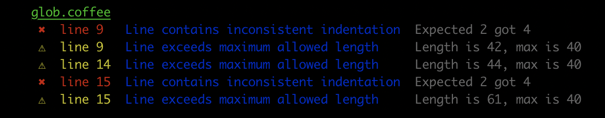

# grunt-coffeelintr

> A Grunt Plugin for Coffeelint

<p align="center">
  
</p>

[CoffeeLint](https://coffeelint.github.io/) is a style checker that helps keep CoffeeScript code clean and consistent.

[](https://www.npmjs.com/package/grunt-coffeelintr)
[](https://github.com/sibiraj-s/grunt-coffeelintr/blob/master/LICENSE)
[](https://github.com/sibiraj-s/grunt-coffeelintr/actions)



## Getting Started

This plugin requires Grunt `>= 1.0.0` and Node.js `>= 10`

If you haven't used [Grunt](http://gruntjs.com/) before, be sure to check out the [Getting Started](http://gruntjs.com/getting-started) guide, as it explains how to create a [Gruntfile](http://gruntjs.com/sample-gruntfile) as well as install and use Grunt plugins. Once you're familiar with that process, you may install this plugin with this command:

```shell
npm install grunt-coffeelintr --save-dev
```

Once the plugin has been installed, it may be enabled inside your Gruntfile with this line of JavaScript:

```js
grunt.loadNpmTasks('grunt-coffeelintr');
```

## The "coffeelintr" task

### Overview

In your project's Gruntfile, add a section named `coffeelintr` to the data object passed into `grunt.initConfig()`.

```js
grunt.initConfig({
  coffeelintr: {
    options: {
      congigFile: 'coffeelint.json',
      force: false
    },
    your_target: {
      files: {
        src: ['**/*.coffee']
      }
    }
  }
});
```

To override any of CoffeeLint's default options, generate a [configuration](https://coffeelint.github.io/#usage) file and tweak it as needed, and specify that file as shown above.
